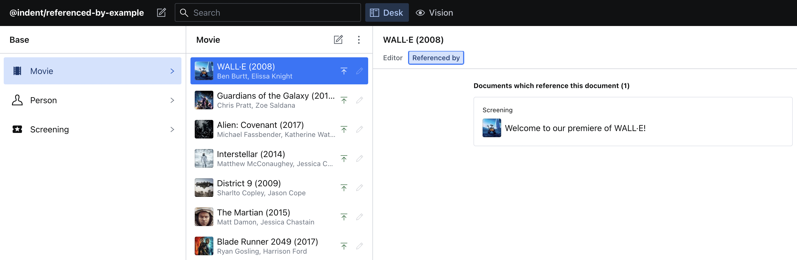

# @indent/sanityio-referenced-by

Plugin for viewing resources which reference a particular resource




## Getting started

1. Have an existing Sanity.io Studio Project

2. Install `@indent/sanityio-referenced-by` plugin using the command line:
```bash
# npm
npm i @indent/sanityio-referenced-by

# yarn
yarn add @indent/sanityio-referenced-by
```

3. Add `@indent/sanityio-referenced-by` to `sanity.json` "plugins":
```json
  // /sanity.json
  "plugins": [
    "@indent/sanityio-referenced-by"
  ],
```

4. Add `sanity-structure.js` reference to `sanity.json` "parts":
```json
  // /sanity.json
  "parts": [
    {
      "name": "part:@sanity/desk-tool/structure",
      "path": "./sanity-structure.js"
    }
  ]
```

5. Create and/or update `sanity-structure.js` in the root directory:

```js
// /sanity-structure.js
import {ReferencedByView} from 'part:@indent/sanityio-referenced-by'
import S from '@sanity/desk-tool/structure-builder'

export const getDefaultDocumentNode = () => {
  return S.document().views([
    S.view.form(),
    S.view.component(ReferencedByView).title('Referenced by'),
  ])
}

export default () => S.list().title('Base').items(S.documentTypeListItems())
```

Please note that Sanity.io Studio requires a `title` as a property of `S` in the `export default` function, but title does not need to be 'Base' for the plugin to work.

6. Run the Sanity.io Studio Project - "Referenced By" plugin tab appears

The `example` directory contains an example Sanity.io Studio project which has the `@indent/sanityio-referenced-by` plugin already installed

## Credits

Thank you to [Devin Halladay](https://www.sanity.io/exchange/community/theflowingsky): [List Referring Documents (Backlinks) in Sanity](https://www.sanity.io/schemas/list-referring-documents-backlinks-in-sanity-1a8ada64)

## License

MIT © [Indent Inc](https://indent.com/)
